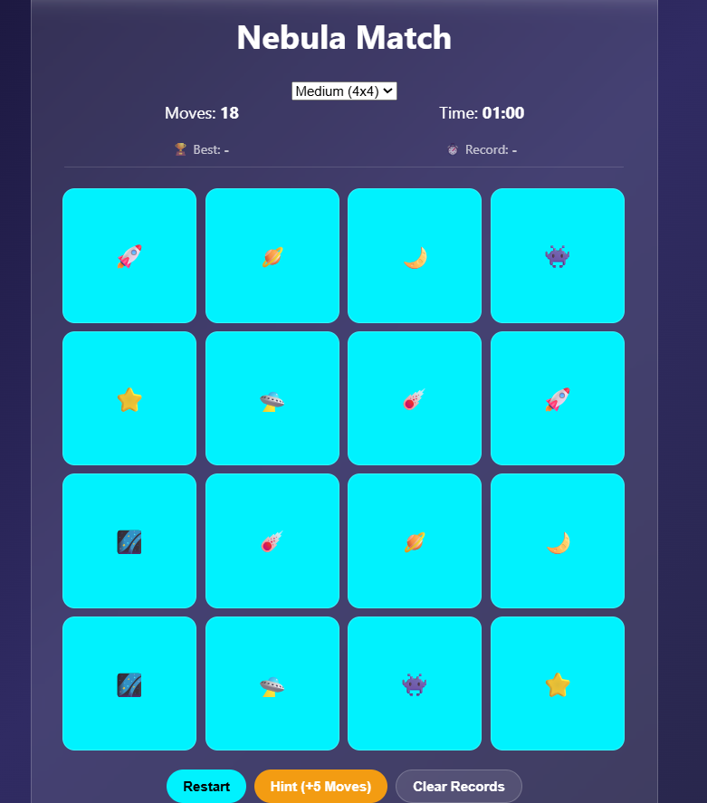

# 🌌 Nebula Match
### The Ultimate Glassmorphic Memory Challenge

Nebula Match is a high-performance, browser-based puzzle game that blends **modern UI design** (Glassmorphism) with **strategic gameplay**. Designed for both casual play and competitive speed-running, it features a dynamic grid system and persistent storage.

---

## 📸 Project Preview

<p align="center">
  
</p>

<p align="center">
  
</p>

---

## 🚀 Key Features

* **Glassmorphic Aesthetic:** Utilizes CSS `backdrop-filter: blur()` and semi-transparent layers for a premium, futuristic look.
* **Three Difficulty Tiers:**
    * **Easy:** 4x3 Grid (6 Pairs) - Perfect for a quick warm-up.
    * **Medium:** 4x4 Grid (8 Pairs) - The classic challenge.
    * **Hard:** 6x6 Grid (18 Pairs) - Designed for memory experts.
* **Intelligent Leaderboard:** Separated tracking for **Best Moves** and **Best Time** specific to each difficulty level using the Web Storage API.
* **Strategic Hint System:** A "Risk vs. Reward" mechanic that reveals the board for 1.5s at the cost of a **+5 move penalty**.
* **Responsive Engine:** Built with CSS Grid to ensure playability on mobile, tablet, and desktop.

---

## 🛠️ Technical Architecture

The game is built using a **Modular File Structure** to ensure clean, maintainable code:

| File | Responsibility | Key Technologies |
| :--- | :--- | :--- |
| `index.html` | Layout & SEO | Semantic HTML5, Google Fonts |
| `style.css` | Visuals & FX | Flexbox, CSS Grid, 3D Transforms |
| `script.js` | Logic & State | ES6+, LocalStorage, Fisher-Yates Shuffle |

### 🧠 Core Logic Highlights
* **Shuffle Algorithm:** Uses the Fisher-Yates shuffle to ensure no two games are ever the same.
* **State Management:** Tracks `flippedCards` in an array to prevent "triple-clicking" and logical errors.
* **Time Formatting:** A custom utility function that converts raw seconds into a clean `MM:SS` string for the UI.

---

## 📖 How to Install & Play

1.  **Clone the Repo**
    ```bash
    git clone [https://github.com/yourusername/nebula-match.git](https://github.com/yourusername/nebula-match.git)
    ```
2.  **Launch**
    No build process or `npm install` required. Simply open `index.html` in any modern evergreen browser (Chrome, Firefox, Safari, Edge).

---

## 📈 Future Roadmap
- [ ] **Zen Mode:** Remove timers and move counts for a relaxed experience.
- [ ] **Customization:** Implement custom card-back uploads.
- [ ] **Cloud Sync:** Global Leaderboards via Firebase integration.

## 📄 License
This project is licensed under the **MIT License**. Feel free to fork, modify, and use it for your own projects!